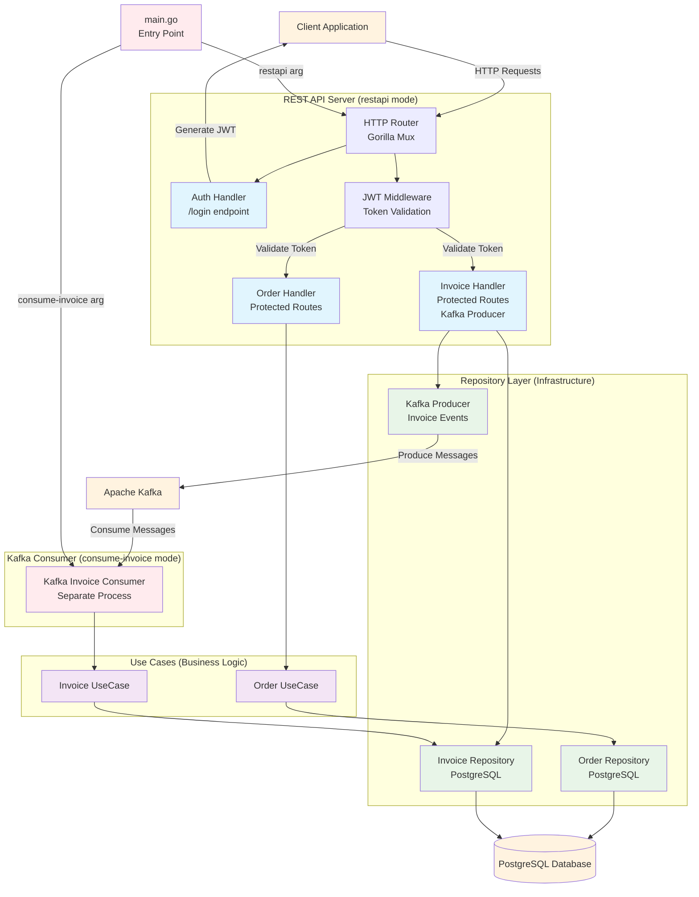

# Go Clean Architecture Boilerplate (REST, Kafka, JWT)

Production-ready Go boilerplate using Clean Architecture, REST API, Kafka, JWT, and Docker.

## Architecture Diagram



## Features
- Clean Architecture (domain/usecase/infrastructure/interface separation)
- REST API (CRUD for User, Order, Invoice)
- Kafka Consumer/Producer (Invoice)
- JWT Authentication (protects all endpoints except /login)
- Docker multi-mode (REST API or Kafka Consumer)
- Centralized config in `internal/config`
- Example .env and JWT generation script
- Error/success logging for DB and Kafka
- Kafka consumer logs partition and offset

## Project Structure
```
go-clean-boilerplate/
├── cmd/                # main.go (entrypoint)
├── internal/
│   ├── config/         # App config, DB setup
│   ├── domain/         # Entity, interface
│   ├── infrastructure/ # DB, Kafka impl
│   ├── interface/      # HTTP handler, router, middleware
│   └── usecase/        # Business logic
├── scripts/            # generate_jwt.go
├── Dockerfile
├── .env.example
├── README.md
```

## Getting Started
1. Clone repo
   ```sh
   git clone <your-repo-url>
   cd go-clean-boilerplate
   ```
2. Create .env file (see .env.example for reference)
3. Build Docker image
   ```sh
   docker build -t go-clean-app .
   ```
4. Run REST API
   ```sh
   docker run --env-file .env -e APP_MODE=restapi -p 8085:8085 go-clean-app
   ```
5. Run Kafka Consumer
   ```sh
   docker run --env-file .env -e APP_MODE=consume-invoice go-clean-app
   ```

## REST API Endpoints
- POST   /login                (get JWT, no token required)
- GET    /orders/{id}          (JWT required)
- DELETE /orders/{id}          (JWT required)
- GET    /orders               (JWT required)
- POST   /orders               (JWT required)
- POST   /invoices             (JWT required, produce invoice to Kafka)

## Example Request/Response
### 1. Get JWT
```sh
curl -X POST http://localhost:8085/login \
  -H 'Content-Type: application/json' \
  -d '{"username":"admin","password":"password"}'
```
Response:
```json
{"token": "<jwt-token>"}
```

### 2. Call API with JWT
```sh
curl -H "Authorization: Bearer <jwt-token>" http://localhost:8085/orders
```

### 3. Example JSON for Invoice (produce to Kafka)
```json
{"order_id": "order-123","amount": 999.99}
```

## JWT
- Set JWT_SECRET in .env
- Use the generate_jwt.go script to create a token for testing

## Kafka
- Set KAFKA_BROKER, KAFKA_INVOICE_TOPIC, KAFKA_INVOICE_GROUP in .env
- Supports SASL/PLAIN (Confluent Cloud) with KAFKA_USERNAME, KAFKA_PASSWORD
- Kafka consumer logs partition and offset for each message

## Kafka Setup & Testing
To create the invoice topic and test producing messages:

```sh
# Create topic (3 partitions)
kafka-topics --create --bootstrap-server localhost:9092 --replication-factor 1 --partitions 3 --topic invoice-topic

# Produce messages to topic
kafka-console-producer --bootstrap-server localhost:9092 --topic invoice-topic
```

## Database Schema
- Make sure your invoices table supports string order_id if you use non-integer IDs
- Example:
  ```sql
  CREATE TABLE invoices (
    id SERIAL PRIMARY KEY,
    order_id VARCHAR(64) NOT NULL,
    amount NUMERIC NOT NULL
  );
  ```

## Logging & Debugging
- All DB insertions (invoice) log error and success with input data
- Kafka consumer logs partition, offset, and handler errors

## Testing
```sh
go test ./...
```

## How to Extend
- Add new entities in `internal/domain/<entity>`
- Implement new repositories in `internal/infrastructure/<entity>`
- Add new use cases in `internal/usecase/<entity>`
- Add new handlers in `internal/interface/http`
- Add config folder

## License
MIT